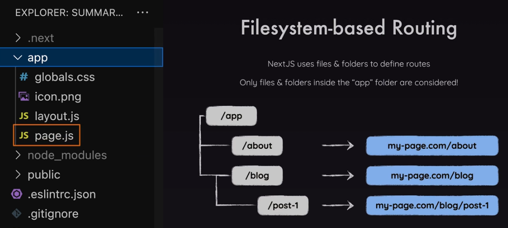
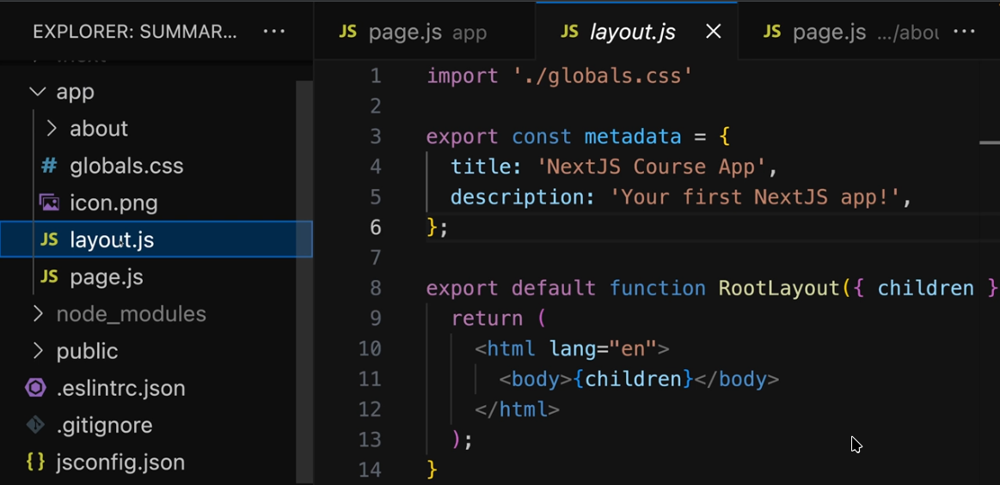
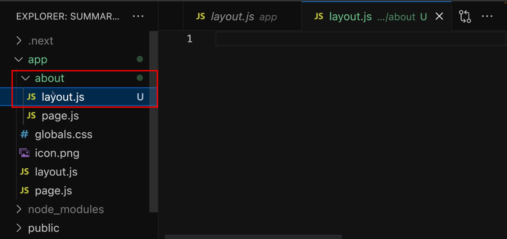
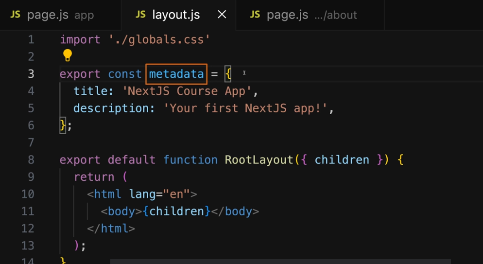

# NextJS

- a React framework

## Why do we need to use it?

- because this is for building Fullstack React apps
- this simplifies of building Fullstack apps with React
- because there is a trend of building Fullstack apps instead of Single-Page applications
- Get the best of both worls: Highly interactive frontends, beldning seamlessly with tightly connected backends

### Fullstack Apps

- React is becoming a hybrid library:

  - Improved server-side rendering
  - Streaming responses
  - React server components
  - Server actions

- NextJS blends frontend + backend(in the same project)
  **Advantage**: Frontend and backend tassk are part of the same project
- Handles route setup & config
- Handles requests & responses
- Handles data fetching & submission

### File-based Routing

- Routes are configured via the filesystem(folders + files)
  **Advantage**: No code-based configuration or extra packages for routing required

### Server-side Rendering

- By default, NextJS(pre-) renders all pages on ther server
  **Advantage**: The finished HTML page(incl. content) is sent to the client(-> great ofr SEO)

This is a [Next.js](https://nextjs.org/) project bootstrapped with [`create-next-app`](https://github.com/vercel/next.js/tree/canary/packages/create-next-app).

## Creating a NextJS Application

```bash
npx create-next-app@latest

```

## Getting Started

First, run the development server:

```bash
npm run dev
# or
yarn dev
# or
pnpm dev
# or
bun dev
```

Open [http://localhost:3000](http://localhost:3000) with your browser to see the result.

You can start editing the page by modifying `app/page.tsx`. The page auto-updates as you edit the file.

This project uses [`next/font`](https://nextjs.org/docs/basic-features/font-optimization) to automatically optimize and load Inter, a custom Google Font.

## Learn More

To learn more about Next.js, take a look at the following resources:

- [Next.js Documentation](https://nextjs.org/docs) - learn about Next.js features and API.
- [Learn Next.js](https://nextjs.org/learn) - an interactive Next.js tutorial.

You can check out [the Next.js GitHub repository](https://github.com/vercel/next.js/) - your feedback and contributions are welcome!

## Deploy on Vercel

The easiest way to deploy your Next.js app is to use the [Vercel Platform](https://vercel.com/new?utm_medium=default-template&filter=next.js&utm_source=create-next-app&utm_campaign=create-next-app-readme) from the creators of Next.js.

Check out our [Next.js deployment documentation](https://nextjs.org/docs/deployment) for more details.

## Two Approaches for Building NextJS Apps

### Pages Router

- Has been around for many years
- Very stable
- Used in many existing NextJS projects
- Allows you to build feature-rich fullstack apps with React

### App Router

- Introduced with NextJS 13
- Marked as stable but still relatively new & partially buggy
- Supports modern Next & React feature (fullstack React apps)

**NOTE**:

- the **app** directory is the most important in the modern NextJS application

  

- In a new NextJS app, the **page.js** is a reserved filename
- the **page.js** is also called a **server component** because NextJS ensures that this is rendered from the server (when you try to use **console.log**, you won't be able to view any log statement in the console logs. Instead, you will see it in the **backend** via the terminal)
- in summary, it is created from a React component but it treated in a special way

### Layout file



- IMO, acts like the parent component of an application wherein you use the **children** props to render the children component.
- Every NextJS projects needs have at **least one root layout JS** file (IMO, this is similar to the **main.tsx/app.js** of a React project wherein you define the **createRoot** component and use the **getElementById** to render the main application component)



- You can also have nested **layout** JS file wherein the layout defined on that certain directory will only be used on that certain directory and to any nested directories there(e.g. a **layout** file in the **about** directory)

- A **wrapper** of one or more pages.

## metadata



- **metadata** is a reserved name in NextJS
- This is where we define the **head** tag of the HTML file
- if you export or define an variable with **metadata**, it should contain an object where you can then set the title of the page and the description of the page and also some other metadata fields that are covered by that layout(e.g. a **layout** file in the root directory)

## Favicon

If you add an **icon.png** in the **app** directory, it will be automatically treated as a **favicon**

## Reserved Filenames

https://nextjs.org/docs/app/api-reference/file-conventions

| Filename     | Function                                                                                                                       |
| ------------ | ------------------------------------------------------------------------------------------------------------------------------ |
| page.js      | Create a new page(e.g., **app/about/page.js**)                                                                                 |
| layout.js    | Create a new layout that wraps sibling and nested pages                                                                        |
| not-found.js | Fallback page for "not Found" errors (thrown by sibling pages or nested pages or layouts)                                      |
| error.js     | Fallback page for other errors (thrown by sibling pages or nested pages or layouts)                                            |
| loading.js   | Fallback page which is shown whilst siblng or nested pages(or layouts) are fetching data                                       |
| route.js     | Allows you to create an API route(i.e., a page which does **NOT** return JSX code but instead data (e.g., in the JSON format)) |

## Dynamic Routes & Using Route Parameters
