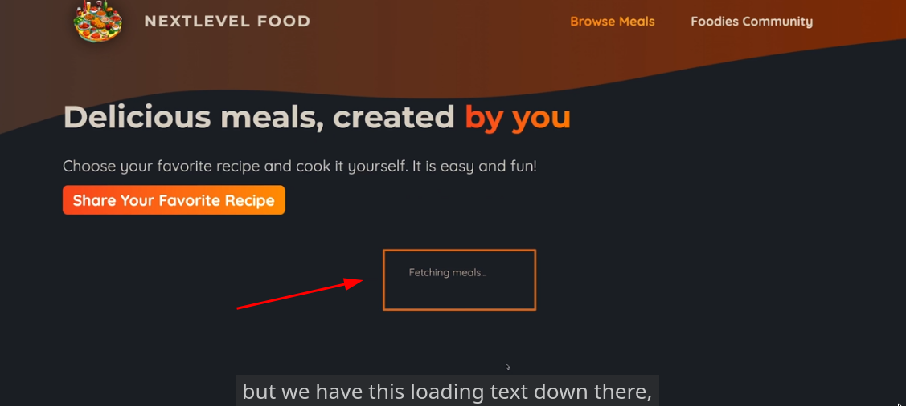

# NextJS

- a React framework

## Why do we need to use it?

- because this is for building Fullstack React apps
- this simplifies of building Fullstack apps with React
- because there is a trend of building Fullstack apps instead of Single-Page applications
- Get the best of both worls: Highly interactive frontends, beldning seamlessly with tightly connected backends

### Fullstack Apps

- React is becoming a hybrid library:

  - Improved server-side rendering
  - Streaming responses
  - React server components
  - Server actions

- NextJS blends frontend + backend(in the same project)
  **Advantage**: Frontend and backend tassk are part of the same project
- Handles route setup & config
- Handles requests & responses
- Handles data fetching & submission

### File-based Routing

- Routes are configured via the filesystem(folders + files)
  **Advantage**: No code-based configuration or extra packages for routing required

### Server-side Rendering

- By default, NextJS(pre-) renders all pages on ther server
  **Advantage**: The finished HTML page(incl. content) is sent to the client(-> great ofr SEO)

This is a [Next.js](https://nextjs.org/) project bootstrapped with [`create-next-app`](https://github.com/vercel/next.js/tree/canary/packages/create-next-app).

## Creating a NextJS Application

```bash
npx create-next-app@latest

```

## Getting Started

First, run the development server:

```bash
npm run dev
# or
yarn dev
# or
pnpm dev
# or
bun dev
```

Open [http://localhost:3000](http://localhost:3000) with your browser to see the result.

You can start editing the page by modifying `app/page.tsx`. The page auto-updates as you edit the file.

This project uses [`next/font`](https://nextjs.org/docs/basic-features/font-optimization) to automatically optimize and load Inter, a custom Google Font.

## Learn More

To learn more about Next.js, take a look at the following resources:

- [Next.js Documentation](https://nextjs.org/docs) - learn about Next.js features and API.
- [Learn Next.js](https://nextjs.org/learn) - an interactive Next.js tutorial.

You can check out [the Next.js GitHub repository](https://github.com/vercel/next.js/) - your feedback and contributions are welcome!

## Deploy on Vercel

The easiest way to deploy your Next.js app is to use the [Vercel Platform](https://vercel.com/new?utm_medium=default-template&filter=next.js&utm_source=create-next-app&utm_campaign=create-next-app-readme) from the creators of Next.js.

Check out our [Next.js deployment documentation](https://nextjs.org/docs/deployment) for more details.

## Two Approaches for Building NextJS Apps

### Pages Router

- Has been around for many years
- Very stable
- Used in many existing NextJS projects
- Allows you to build feature-rich fullstack apps with React

### App Router

- Introduced with NextJS 13
- Marked as stable but still relatively new & partially buggy
- Supports modern Next & React feature (fullstack React apps)

**NOTE**:

- the **app** directory is the most important in the modern NextJS application

  

- In a new NextJS app, the **page.js** is a reserved filename
- the **page.js** is also called a **server component** because NextJS ensures that this is rendered from the server (when you try to use **console.log**, you won't be able to view any log statement in the console logs. Instead, you will see it in the **backend** via the terminal)
- in summary, it is created from a React component but it treated in a special way

### Layout file


- IMO, acts like the parent component of an application wherein you use the **children** props to render the children component.
- Every NextJS projects needs have at **least one root layout JS** file (IMO, this is similar to the **main.tsx/app.js** of a React project wherein you define the **createRoot** component and use the **getElementById** to render the main application component)


- You can also have nested **layout** JS file wherein the layout defined on that certain directory will only be used on that certain directory and to any nested directories there(e.g. a **layout** file in the **about** directory)

- A **wrapper** of one or more pages.

## metadata


- **metadata** is a reserved name in NextJS
- This is where we define the **head** tag of the HTML file
- if you export or define an variable with **metadata**, it should contain an object where you can then set the title of the page and the description of the page and also some other metadata fields that are covered by that layout(e.g. a **layout** file in the root directory)

## Favicon

If you add an **icon.png** in the **app** directory, it will be automatically treated as a **favicon**

## Reserved Filenames

https://nextjs.org/docs/app/api-reference/file-conventions

| Filename     | Function                                                                                                                       |
| ------------ | ------------------------------------------------------------------------------------------------------------------------------ |
| page.js      | Create a new page(e.g., **app/about/page.js**)                                                                                 |
| layout.js    | Create a new layout that wraps sibling and nested pages                                                                        |
| not-found.js | Fallback page for "not Found" errors (thrown by sibling pages or nested pages or layouts) r                                    |
| error.js     | Fallback page for other errors (thrown by sibling pages or nested pages or layouts)                                            |
| loading.js   | Fallback page which is shown whilst siblng or nested pages(or layouts) are fetching data                                       |
| route.js     | Allows you to create an API route(i.e., a page which does **NOT** return JSX code but instead data (e.g., in the JSON format)) |

## Dynamic Routes & Using Route Parameters

In order to have multiple pages in NextJS (e.g., a **blog** with multiple pages), we can use **square brackets** and define a placeholder inside (e.g., **slug**). Then, create a **page.js** file. It is this **page.js** that is becoming active for different segment path values.

The **square bracket** here simply tells NextJS that we want to have some path segment after blog in this case that we don't know the exact value of the segment yet. And then it's this placeholder, this identifier **slug** that will give us access to the concrete value that we do get when that route is loaded.

Because NextJS passes a **props** to all those page components(pages in the **slug**) which you can pull out with the help of destructuring. This is the **params** props


The inside of the **params** prop is an object where every placeholder you had in such a dynamic route here will be a **key** and the **value** store under that key is the concrete value encoded in the URL(e.g., **post-1**)

## Server vs Client Components

- NextJS knows **Server Components**, **React Server Components**, **Client Components**


**NOTE**: When you are using Create-React-App, you are using **Client Components** out of the box because ReactJS is a pure client side library running code in the browser on the client.


- In NextJS, this changes because NextJS is a fullstack framework
- By default, all the React components you have in NextJS no matter if they are layouts, pages, or standard components are only rendered in the server that's why they are called **React Server Components**

## NOTE

- As much as possible, only use **use client** down to the component tree

## Images with Unknown Dimensions


- The **fill** property in Image component fill the available space with that image
- **NOTE**: We should avoid using **fill** if we know the width and height of the image

## Suspense

- a component provided by React that allows you to handle loading states and show fallback content until some data or resources has been loaded.




In this example, since we use **Suspense** and wrapped it on our **Meals** component, it is only in this part that our loading fallback exist.

## Handling Errors

- when using **error.js** (a file that handle potential errors that might be generated by your pages and components), it must use **use client** simply because NextJS ensures that you can catch any errors with that component from the server including the components/pages on the client side.
- when using **error.js**, the file will only handle errors that occur in the page that sits in the same folder.
- in the **error.js**, it will provide an **error** prop which can contain more details about the error. We can utilize the **error** prop to display a fine tuned error message
- the actual error message will actually be hidden by NextJS so that you can't accidentally expose any information that shouldn't be exposed to your end users.

- we can use **not-found.js** which handles 404 error message

## NOTE

- in a **page.js** or component in those special files, you can access special props such as **params** which you receive if it is under a page

## notFound

- a NextJS function that will throw the error page that is closer to the page/component that **notFound** function is declared. For example, if we have a **slug** page in **meals** page and have an **error.js** file in that same directory, **notFound** function will use the closest **error.js** file and show that as an error.

## use server

- **NOTE** This will only work if our component is not a client.
- **NOTE** Another approach is using a separate files for **Server Actions**

- creates a so-called **Server Action** which guarantee that the action only execute on the server and only there. So we don't need to use **onSubmit** on forms because NextJS is a fullstack application.
- should use **async** function when using a **Server Action**
- when using **Server Action** in a form, it should be a value on the **action** prop of a form


## Creating a Slug & Sanitizing User Inptu for XSS Protection

```bash
npm i xss slugify

```

**XSS** is a package used for protecting against scripting attacks by sanitizing data while **slugify** works by transliterating Unicode characters into alphanumeric strings (e.g. 字 into zi ).

**NOTE**: Images should be stored in the filesystem and not in the database because it is bad in performance and simply it is not built for that

## useActionState

- Passes two values to the action data which will exist in the first parameter, while the second parameter will remain as the actual value of the data

## Development to Production

```bash
npm run build

```

This will build and prepare our NextJS application for production. Generally, build us a project that we can deploy to our server.

```bash
npm start

```

This will not start a **development** server but a **production** server. Take note that it will still be hosted on the same port but the reality is its the optimized code since we ran **npm run build**

## Understanding NextJS Caching

- When we run **npm run build**, NextJS pre-generated the pages. This means that the pages are prerendered as **static content** so right from the start, the pages are available so when you refresh the page. Any changes from the code will not be rendered dynamically to the page.
- The downside of this approach is it never refetches any data added to the database.

  - **FIX** We need to use **revalidatePath** function. This tells NextJS to revalidate the cache that belongs to a certain route path. This means it will throw away the cache for revalidation.

  ```javascript
    export default Meals(){

      ... //other code

      revalidatePath("/meals"); // by default, it will use the "page"
      // revalidatePath("/meals", "layout"); // revalidate the "/meals" and the nested pages
      // revalidatePath("/meals", "page"); // means to revalidate the page which has this path "/meals"
      redirect('/meals')
    }
  ```

## Generating Dynamic metadata

```javascript
// The "generateMetadata" is a predefined function built in NextJS

export async function generateMetadata({ params }) {
  const metal = getMeal(params.mealSlug);

  if (!meal) notFound();

  return {
    title: meal.title,
    description: meal.summary,
  };
}
```

## Dynamic Routes


## Parallet Routes

- A feature that allows you to render the content of two separate routes with separate paths on one and the same page.
- To setup, we must have a **layout**
- We can use **parallel routes** by using **@** symbol (this is part of the naming convention NextJS looks for).

```javascript
// app/archive/@archive/page.tsx
export default function ArchivePage(){
  return <h1>Archive Page</h1>
}

// app/archive/@latest/page.tsx
export default function LatestPage(){
  return <h1>Latest Page</h1>
}

// What happened here is that the Layout receive another props which are the parallel routes filename after the '@'
// So we can access/render the template existing in the @archive/page.tsx and @latest/page.tsx

// The layout page will render these templates. As explained earlier, we must have a layout file
// app/archive/layout.tsx
export default function ArchiveLayout({archive, latest}) {
  return <>
   The Archive Page
  <div>
   {archive}
  </div>
  The Latest Page
  <div>
    {latest}
  </div>
  </>
}

```

- **NOTE**
  1. Must make sure that all the parallel routes that are shown in the same page do support all the different paths you wanna support there.
  2. We can use **default.js** to define the default fallback content that should be displayed if that route doesn't have a more specific content for the path that's currently loaded.
  3. We can remove **page.js** of the other parallel route if the **default.js** file has the same content of the **page.js** file(remember that parallel route uses **page.js** to render a template)


## Configuring Catch-All Routes

- We can create a **catch-all routes** by naming a file inside two square brackets and then adding three dots before the name(e.g. [[...filter]])

- **catch-all routes** make sure that the **page.js** file inside the **catch-all route** will be activated for any path segments after archive no matter how many segments we have there and no matter how they're named.


**NOTE** Unlike before that we have a **page.js** file in a **parallel route**, for a **catch-all route**, we cannot have a **page.js** file but only inside the **catch-all route** file. In the attached image, **page.js** is inside **[[...filter]]** which is a **catch-all route** file and there is no **page.js** file inside the **@archive** directory

## Interceptor(Intercepting) Route

https://nextjs.org/docs/app/building-your-application/routing/intercepting-routes


- To use intercepting route, you need to use parenthesis **()** with the URL path location followed by the filename/route name (e.g. **(.)image**)
- An alternative route which sometimes gets activated depending on whether you are navigating to it through an internal link from within the page or manually inputted the URL or from an external link. The idea is, **for that same path, different pages are shown depending on how you got there**.
- The intercepting route essentially intercepts an internal navigation request. Instead of showing the page you would see if you reload the page or come to the page from outside the website, a **different page will be shown**.
- Useful for showing modal
- **NOTE** - if the **layout.js** file and the **page.js** file is beside each other, the **page.js** file will be made available in the **children** prop.

## Combing Parallel & Intercepting Routes


- (We thought that we should use double period '(..)image but NOT exactly')The **.** in the **(.)image** is not a path in the folder system but instead in the URL path that will be rendered because of the folder structure. And the **parallel routes** like **@modal** don't add anything to the URL, these are just there to organize the files in a certain way NextJS expects.
- Since we are using **parallel routes** for displaying **intercepting routes**, we must add a **default.js** or **page.js** and return **null** so that no visible content will be available for this **parallel route**(For this case, we want to return **null**) **NOTE**, we might have changed **page.js** to **default.js** in our **parallel route** **@modal/page.js**

## Route Group

Problem: Have a different Navigation layout for the HomePage and for the rest of the pages

- Route group is setup by adding a new folder in your app folder and that could be a folder nested in some other route as well.

- For our case, we will add it on our **app** directory and it should be inside a parenthesis. The name will be of your choice
- Route group **does not add anything to the URL path**
- The **advantage** is it will setup a dedicated layout, in this case since it's directly at the root of the app folder, is a dedicated **root layout**


- In this folder structure, we have 2 **layout.js**, one which does have a **Navigation** menu while the other does not have. This will solve our problem discussed earlier
- **NOTE** - The **not-found.js** here will be placed inside the **(content)** route group

## Route Handlers

Objective: We will add a feature that won't belong to any **route groups** because it won't render an ordinary page and therefore it won't need a layout.

- the **request.js** is a reserved name in NextJS
- A **route handler** is a file in which you can export various functions which must be named **GET**, **POST**, **PATCH**, or **PUT** and so on which must have an **HTTP** method name.
- Because the idea of **route handlers** is that you can setup routes that don't return pages that are rendered on the screen but instead in the **Route Handlers** are typically returned **JSON** data or you would accept incoming **JSON** data and return some **JSON** response.
- Generally, the idea is setting up **API** like routes which produce data, store data, or do whatever you need to do.


## Middleware

https://nextjs.org/docs/app/building-your-application/routing/middleware

- **middleware.js** is a reserved filename in NextJS and should be located in the root project folder.
- the function name should also be **middleware** and should be exported

```javascript
import { NextResponse } from "next/server";

// the 'request' parameter is passed by NextJS
// The 'middleware' is function that's not really meant to block or handle an incoming request, though you could do that
// but instead it's typically meant to take a look at some incoming request, maybe change it a bit, maybe block it,
// for example, to implement authentication and maybe redirect to another page if a user is not authenticated for example.
export default function middleware(request) {
  return NextResponse.next();

  // the 'next' utility method simply forwards the incoming request to its actual destination (maybe after evaluating or changing it)
}

export const config = {
  matcher: "/news",

  // Middleware will be invoked for every route in your project. Given this, it's crucial to use matchers to precisely target or exclude specific routes. The following is the execution order:

  // matcher allows you to filter Middleware to run on specific paths.
};
```

- Middleware dopes allow you to setup code that will run on every request that's sent to any page or any route anywhere in your entire website so that you can inspect that request block or redirect the request or do whatever you want to do.
